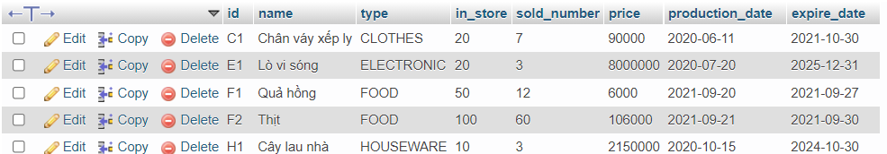

# Buổi 1

## Mục lục

<a id="p0"></a>

- [Tạo DATABASE có tên store](#p1)
- [Tạo ra TABLE product](#p2)
- [Thêm 5 sản phẩm vào bảng vừa tạo](#p3)

## Bước 1: Tạo DATABASE có tên store

<a id="p1"></a>

- Tạo ra một DATABASE ban đầu có tên là store

  ```sql
  CREATE DATABASE store
  ```

[Quay lại mục lục](#p0)

## Bước 2 Tạo ra TABLE product

<a id ="p2"></a>

- Chọn DATABASE store, tạo ra bảng product với các thuộc tính như sau

  ```sql
  USE store;
  CREATE TABLE product(
    id VARCHAR(20) PRIMARY KEY,
    name VARCHAR(50),
    type ENUM('FOOD', 'HOUSEWARE', 'ELECTRONIC', 'CLOTHES'),
    in_store INT,
    sold_number INT,
    price BIGINT,
    production_date DATE,
    expire_date DATE
  )
  ```

  - `id`: `VARCHAR` - mã sản phẩm - khai báo là `PRIMARY KEY`
  - `name`: `VARCHAR` - tên sản phẩm
  - `type` : `ENUM` - loại sản phẩm
  - `in_store`: `INT` - số lượng trong kho
  - `sold_number`: `INT` - số lượng bán ra
  - `price` : `BIGINT` - giá bán sản phẩm
  - `production_date` : `DATE` - ngày sản xuất
  - `expire_date` : `DATE` - hạn sử dụng

[Quay lại mục lục](#p0)

## Bước 3 Thêm 5 sản phẩm vào bảng vừa tạo

<a id ="p3"></a>

- Lần lượt thêm 5 sản phẩm như sau

  ```sql
    INSERT INTO product(id, name, type, in_store, sold_number, price, production_date, expire_date)
    VALUES("F1", "Quả hồng", 'FOOD', 50, 12, 6000, '2021-09-20', '2021-09-27');
    INSERT INTO product(id, name, type, in_store, sold_number, price, production_date, expire_date)
    VALUES('F2', "Thịt", 'FOOD', 100, 60, 106000, '2021-09-21', '2021-09-30');
    INSERT INTO product(id, name, type, in_store, sold_number, price, production_date, expire_date)
    VALUES('E1', "Lò vi sóng", 'ELECTRONIC', 20, 3, 8000000, '2020-07-20', '2025-12-31');
    INSERT INTO product(id, name, type, in_store, sold_number, price, production_date, expire_date)
    VALUES("C1", "Chân váy xếp ly", 'CLOTHES', 20, 7, 90000, '2020-06-11', '2021-10-30');
    INSERT INTO product(id, name, type, in_store, sold_number, price, production_date, expire_date)
    VALUES("H1", "Cây lau nhà", 'HOUSEWARE', 10, 3, 2150000, '2020-10-15', '2024-10-30');
  ```

- Kết quả

  

[Quay lại mục lục](#p0)
