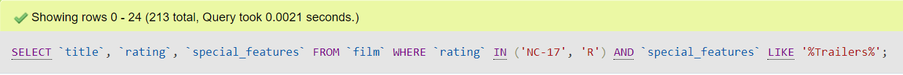
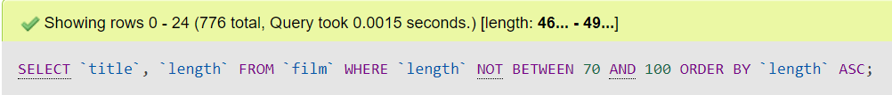
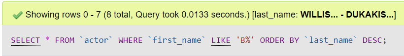
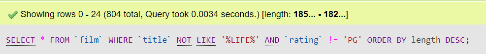

# Bài tập về nhà - Buổi 2

### **1. Lấy tên phim, rating, special_features các bộ phim có rating là NC-17 hoặc R, có special_features là Trailers**

- Câu lệnh truy vấn

  ```sql
  SELECT `title`, `rating`, `special_features` FROM `film`
  WHERE `rating` IN ('NC-17', 'R')
  AND `special_features` LIKE '%Trailers%';
  ```

- Kết quả

  

### **2. Lấy ra tên phim, length các bộ phim có length nhỏ hơn 70 hoặc length lớn hơn 100. Sắp xếp phim theo thứ tự length tăng dần**

- Câu lệnh truy vấn

  ```sql
  SELECT `title`, `length` FROM `film`
  WHERE `length` NOT BETWEEN 70 AND 100
  ORDER BY `length` ASC
  ```

- Kết quả

  

### **3. Lấy ra các actor có first_name bắt đầu là chữ B và sắp xếp theo thứ tự last_name tăng dần**

- Câu lệnh truy vấn

  ```sql
  SELECT * FROM `actor`
  WHERE `first_name` LIKE 'B%'
  ORDER BY `last_name` DESC;
  ```

- Kết Quả

  

### **4. Lấy ra các bộ phim không có chứa từ 'LIFE', không phải rating PG và sắp xếp theo thứ tự length giảm dần**

- Câu lệnh truy vấn

  ```sql
  SELECT * FROM `film`
  WHERE `title` NOT LIKE '%LIFE%' AND `rating` != 'PG'
  ORDER BY `length` DESC;
  ```

- Kết Quả

  
