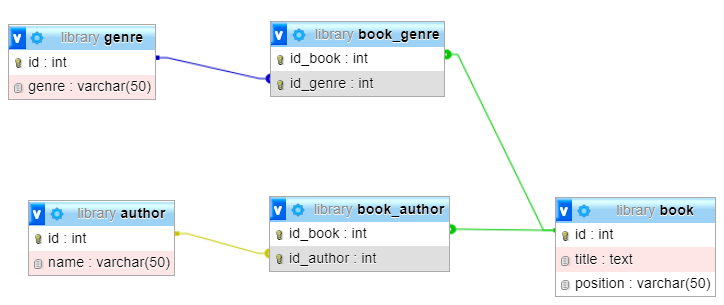
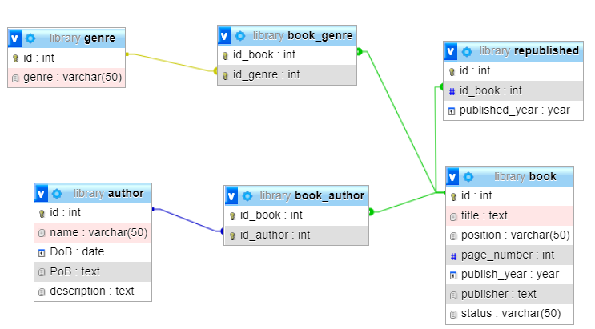
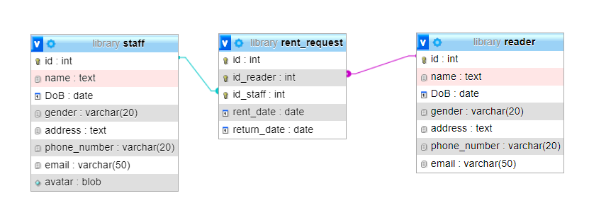
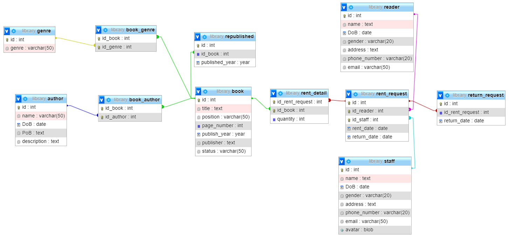

# Mục lục

<a id="p0"></a>

- [Bước 1: Tạo database library](#p1)
- [Bước 2: tạo table book, genre, author, và các bảng liên kết](#p2)
- [Bước 3: Thêm các thông tin vào bảng book và author. Thêm bảng tái bản](#p3)
- [Bước 4: Tạo table staff, reader, và rent_request](#p4)
- [Bước 5: Tạo table rent_detail và return_request](#p5)

## Bước 1: Tạo database library

<a id="p1"></a>

```sql
CREATE DATABASE library
```

[Quay lại mục lục](#p0)

## Bước 2: tạo table book, genre, author, và các bảng liên kết

<a id="p2"></a>

- Tạo bảng book

  ```sql
  CREATE TABLE book(
      id INT PRIMARY KEY,
      title TEXT NOT NULL,
      position VARCHAR(50) NOT NULL
  )
  ```

- Tạo bảng genre

  ```sql
  CREATE TABLE genre (
      id INT PRIMARY KEY,
      genre VARCHAR(50) NOT NULL
      )
  ```

- Tạo bảng book_genre

  ```sql
  CREATE TABLE book_genre (
      id_book INT,
      id_genre INT,
      PRIMARY KEY(id_book, id_genre),
      FOREIGN KEY (id_book) REFERENCES book(id),
      FOREIGN KEY (id_genre) REFERENCES genre(id)
      )
  ```

- Thêm table author

  ```sql
  CREATE TABLE author(
    id INT PRIMARY KEY,
    name VARCHAR(50) NOT NULL
  )
  ```

- Thêm table book_author

  ```sql
  CREATE TABLE book_author(
    id_book INT,
    id_author INT,
    PRIMARY KEY(id_book, id_author),
    FOREIGN KEY(id_book) REFERENCES book(id),
    FOREIGN KEY(id_author) REFERENCES author(id)
  );
  ```

- Kết quả

  

[Quay lại mục lục](#p0)

## Bước 3: Thêm các thông tin vào bảng book và author. Thêm table republished

<a id="p3"></a>

- Thêm một số thông tin của tác giả

  ```sql
  ALTER TABLE author
  ADD DoB DATE,
  ADD PoB TEXT,
  ADD description TEXT
  ```

- Thêm một số thông tin của sách

  ```sql
  ALTER TABLE book
  ADD COLUMN page_number INT NOT NULL,
  ADD COLUMN publish_year YEAR,
  ADD COLUMN publisher TEXT NOT NULL,
  ADD COLUMN status VARCHAR(50);
  ```

- Thêm table republished

  ```sql
  CREATE TABLE republished (
  id INT PRIMARY KEY,
  id_book INT NOT NULL,
  FOREIGN KEY (id_book) REFERENCES book(id),
  published_year YEAR NOT NULL
  )
  ```

- Kết quả

  

[Quay lại mục lục](#p0)

## Bước 4: Tạo table staff, reader, và rent_request

<a id="p4"></a>

- Tạo table staff

  ```sql
  CREATE TABLE staff(
  id INT PRIMARY KEY,
  name TEXT NOT NULL,
  DoB DATE NOT NULL,
  gender VARCHAR(20) NOT NULL,
  address TEXT,
  phone_number VARCHAR(20) NOT NULL,
  email VARCHAR(50) NOT NULL,
  avatar BLOB,
  )
  ```

- Tạo table reader

  ```sql
  CREATE TABLE reader(
  id INT PRIMARY KEY,
  name TEXT NOT NULL,
  DoB DATE NOT NULL,
  gender VARCHAR(20),
  address TEXT,
  phone_number VARCHAR(20) NOT NULL,
  email VARCHAR(50)
  )
  ```

- Tạo bảng phiếu mượn

  ```sql
  CREATE TABLE rent_request(
  id INT,
  id_reader INT,
  id_staff INT,
  PRIMARY KEY (id, id_reader, id_staff),
  FOREIGN KEY (id_reader) REFERENCES reader(id),
  FOREIGN KEY (id_staff) REFERENCES staff(id),
  rent_date DATE NOT NULL,
  return_date DATE NOT NULL
  )
  ```

- Kết quả

  

[Quay lại mục lục](#p0)

## Bước 5: Tạo table rent_detail và return_request

<a id="p5"></a>

- Tạo table rent_detail

  ```sql
  CREATE TABLE rent_detail(
  id_rent_request INT,
  id_book INT,
  PRIMARY KEY(id_rent_request, id_book)
  FOREIGN KEY (id_rent_request) REFERENCES rent_request(id),
  FOREIGN KEY (id_book) REFERENCES book(id),
  quantity INT NOT NULL
  )
  ```

- Tạo table return_request

  ```sql
  CREATE TABLE return_request(
  id INT PRIMARY KEY,
  id_rent_request INT,
  FOREIGN KEY (id_rent_request) REFERENCES rent_request(id),
  return_date DATE NOT NULL
  )
  ```

- Kết quả

  

[Quay lại mục lục](#p0)
