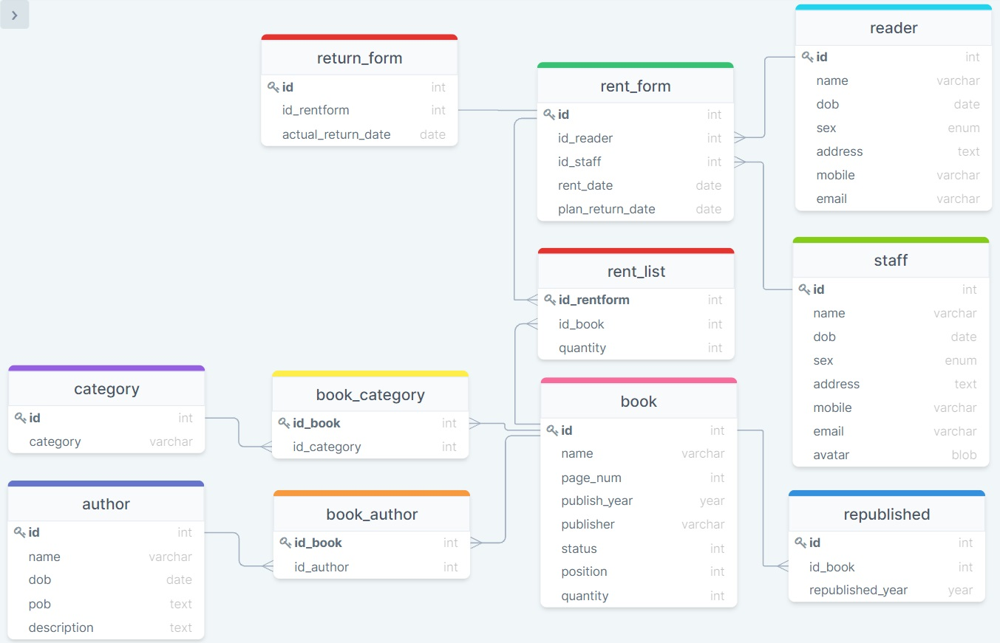

# Bài tập cuối kỳ

## Designer



## Các query

- Liệt kê danh sách độc giả đang mượn sách

  ```sql
  SELECT reader.name AS Reader_Name FROM reader
  INNER JOIN rent_form ON reader.id = rent_form.id_reader
  GROUP BY rent_form.id_reader;
  ```

  Kết quả

  

- Liệt kê các quyển sách thuộc thể loại bất kỳ

  ```sql
  SELECT category.category_name, JSON_ARRAYAGG(book.name) AS Book_List
  FROM category
  INNER JOIN book_category ON category.id = book_category.id_category
  INNER JOIN book ON book.id = book_category.id_book
  WHERE category.id = 3;
  ```

  Kết quả

  

- Đưa ra số lần tái bản của một cuốn sách bất kì

  ```sql
  SELECT book.name AS Book_Title, COUNT(republished_book.id_book) AS Counting
  FROM republished_book
  INNER JOIN book ON republished_book.id_book = book.id
  WHERE book.id = 3
  ```

  Kết Quả

  

- Liệt kê thông tin các độc giả mượn sách nhưng quá hạn trả và id, tên cuốn sách mà độc giả đó đang mượn

  ```sql
  SELECT reader.id AS Reader_ID,
  reader.name AS Reader_Name,
  rent_form.rent_date AS Rent_Date,
  rent_form.plan_return_date AS Plan_return_date,
  return_form.actual_return_date AS Actual_return_date,
  book.id AS Book_ID,
  book.name AS Book_title FROM rent_form
  LEFT JOIN return_form ON rent_form.id = return_form.id_rentform
  INNER JOIN reader ON rent_form.id_reader = reader.id
  INNER JOIN rent_list ON rent_list.id_rentform = rent_form.id
  INNER JOIN book ON book.id = rent_list.id_book
  WHERE (rent_form.plan_return_date < CURDATE()) AND (return_form.actual_return_date IS NULL)
  ```

  Kết quả

  
